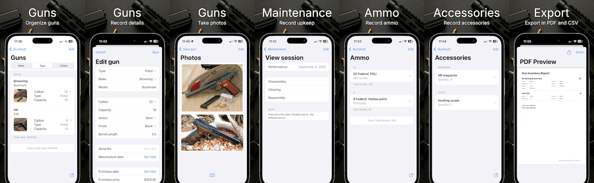

## Description

Gun Vault is designed to be a personal record keeping app for anyone who owns a firearm collection

## Features

- Firearms inventory - keep track of various details about each item: make, model, serial number, caliber, finish etc.
- Photo library - capture/import, organize and share photos for each firearm.
- Customizations - customize various lookup options in order to optimize entering data.

## Supported devices

Gun Vault supports all iPhone and iPad devices running iOS 10 or newer.

## Price

- The Free version of Gun Vault has no limitations on number of items that can be stored.
- The available in-app purchase will unlock additional capabilties: cross-device sync via iCloud, PDF reporting, and CSV data export

## Version history

- [Version history can be seen here](/projects/gunvault/versions)

## Backlog

- [Backlog can be seen here](/projects/gunvault/backlog)

## Privacy policy

- [Privacy policy can be read here](/projects/gunvault/privacy)

## Feedback

Send any feedback using the form below.

